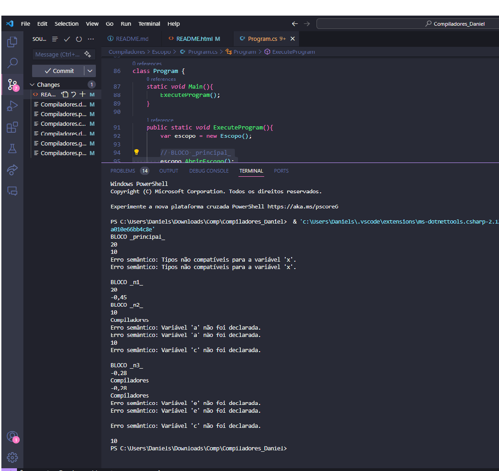

<!DOCTYPE html>
<html>
<head>
</head>
<body>
    <h2>1. Introdução</h2>
    
Neste projeto, foi desenvolvida uma implementação de escopo para uma linguagem de programação fictícia. 
        O objetivo era criar um sistema que gerenciasse escopos, permitindo a declaração e atribuição de variáveis, bem como a verificação de tipos e a exibição de erros semânticos.
    

    

    <h2>2. Estrutura do Código</h2>
    
O código foi dividido em três classes principais: <strong>Escopo, VariableInfo e Program.</strong>

    <ol>
        <li>
            <strong>Escopo:</strong>
            <ul>
                <li><strong>Propósito:</strong></li> Representa um escopo na linguagem fictícia.
                <li><strong>Funcionalidades:</strong></li>
                <ul>
                    <li>Inicializa uma tabela de símbolos com um escopo global no construtor.</li>
                    <li>Permite abrir e fechar escopos.</li>
                    <li>Declara e atribui variáveis.</li>
                    <li>Atribui valores e tipos às variáveis.</li>
                    <li>Fornece métodos para obter valores e tipos de variáveis em diferentes escopos.</li>
                </ul>
            </ul>
        </li>
        <li>
            <strong>VariableInfo:</strong>
            <ul>
                <li><strong>Propósito:</strong></li> Armazena informações sobre uma variável, incluindo seu valor e tipo.
                <li><strong>Funcionalidades:</strong></li> 
                <ul>
                    <li>Propriedade <b>Value</b> para armazenar o valor da variável.</li>
                    <li>Propriedade <b>Type</b> para armazenar o tipo da variável.</li>
                </ul>
            </ul>
        </li>
        <li>
            <strong>Program:</strong> 
            <ul>
                <li><strong>Propósito:</strong></li> Contém o método Main que serve como ponto de entrada do programa.
                <li><strong>Funcionalidade:</strong></li> Instancia um objeto da classe <b>Escopo</b> para gerenciar escopos e executa o código do programa fictício dentro do escopo principal.
            </ul>            
        </li>
    </ol>
    
    
    <h3>2.1 Classe Escopo</h3>
        

        

            

                <pre>
                    <code>
// Classe que representa informações sobre uma variável, incluindo seu valor e tipo.
class VariableInfo {
    // Propriedade para armazenar o valor da variável.
    public object Value { get; set; }
    // Propriedade para armazenar o tipo da variável.
    public string Type { get; set; }
}
// Classe que representa um escopo na linguagem fictícia.
class Escopo {
    // Tabela de símbolos que mapeia identificadores para informações sobre variáveis.
    private List&lt;Dictionary&lt;string, VariableInfo&gt;&gt; symbolTable;
    // Construtor da classe Escopo. Inicializa a tabela de símbolos com um escopo global.
    public Escopo(){
        symbolTable = new List&lt;Dictionary&lt;string, VariableInfo&gt;&gt; { new Dictionary&lt;string, VariableInfo&gt;() };
    }
    // Métodos para abrir e fechar escopos, declarar e atribuir variáveis, e obter valores e tipos de variáveis.
    // ...
}               
                    </code>
                </pre>
            

        

        

    <h3>2.2 Classe VariableInfo</h3>
        

        

            

                <pre>
                    <code>
// Classe que representa informações sobre uma variável, incluindo seu valor e tipo.
// Classe que representa informações sobre uma variável, incluindo seu valor e tipo.
class VariableInfo {
    // Propriedade para armazenar o valor da variável.
    public object Value { get; set; }
    // Propriedade para armazenar o tipo da variável.
    public string Type { get; set; }
}
                    </code>
                </pre>
            

        

        

    <h3>2.3 Classe Program</h3>
        

        

            

                <pre>
                    <code>
// Classe que representa o programa principal.
class Program {
    static void Main(){ 
        ExecuteProgram();
    }
    public static void ExecuteProgram(){
        var escopo = new Escopo();
        // Inicia o escopo principal.
        escopo.AbrirEscopo();
        // Código do programa fictício.
        // FIM do escopo principal.
        escopo.FecharEscopo();
    }
}
                    </code>
                </pre>
            

        

        

    <h2>3. Operações Principais</h2>
    

    <h3>3.1 Construção do Escopo</h3>
    

    
No construtor da classe Escopo, uma tabela de símbolos é iniciada com um escopo global.

    

    

        <pre>
            <code>
// Construtor da classe Escopo. Inicializa a tabela de símbolos com um escopo global.
public Escopo(){
    symbolTable = new List&lt;Dictionary&lt;string, VariableInfo&gt;&gt; { new Dictionary&lt;string, VariableInfo&gt;() };
}
            </code>
        </pre>            
    

    

    <h3>3.2 Abertura e Fechamento de Escopo</h3>
    

    
Para abrir um novo escopo, é adicionado um novo dicionário à tabela de símbolos. Para fechar um escopo, o último dicionário da tabela é removido.

    

    

        <pre>
            <code>
// Método para abrir um novo escopo.
public void AbrirEscopo(){
    symbolTable.Add(new Dictionary&lt;string, VariableInfo&gt;());
}
// Método para fechar o escopo atual.
public void FecharEscopo(){
    if (symbolTable.Count > 1)
        symbolTable.RemoveAt(symbolTable.Count - 1);
    else
        Console.WriteLine("Erro semântico: Tentativa de fechar escopo global.");
}
            </code>
        </pre>            
    

    

    <h3>3.3 Declaração e Atribuição de Variáveis</h3>
    

    
Os métodos DeclararVariavel e AtribuirValor lidam com a declaração e atribuição de variáveis, respectivamente.

    

    

        <pre>
            <code>
// Método para declarar uma variável em um escopo.                    
public void DeclararVariavel(string identificador, object valor = null, string tipo = null)    {
    var escopoAtual = symbolTable[symbolTable.Count - 1];
    if (escopoAtual.ContainsKey(identificador))
        Console.WriteLine($"Erro semântico: Variável '{identificador}' já foi declarada neste escopo.");
    else
        escopoAtual[identificador] = new VariableInfo { Value = valor, Type = tipo };
}
// Método para atribuir um valor a uma variável em um escopo.
public void AtribuirValor(string identificador, object valor){
    var escopoAtual = symbolTable[symbolTable.Count - 1];
    if (escopoAtual.ContainsKey(identificador)){
        var variavel = escopoAtual[identificador];
        // Verifica se os tipos são compatíveis antes de atribuir o valor.
        if (variavel.Type != null && valor != null && valor.GetType() != Type.GetType(variavel.Type))
            Console.WriteLine($"Erro semântico: Tipos não compatíveis para a variável '{identificador}'.");
        else
            variavel.Value = valor;
    }
    else
        Console.WriteLine($"Erro semântico: Variável '{identificador}' não foi declarada.");
}
            </code>
        </pre>            
    

    

    <h3>3.4 Obtenção de Valores e Tipos de Variáveis</h3>
    

    
Os métodos ObterValor e ObterTipo permitem a obtenção de valores e tipos de variáveis em diferentes escopos.

    

    

        <pre>
            <code>
// Método para obter o valor de uma variável em um escopo.
public object ObterValor(string identificador)    {
    for (int i = symbolTable.Count - 1; i >= 0; i--){
        var escopoAtual = symbolTable[i];
        if (escopoAtual.ContainsKey(identificador))
            return escopoAtual[identificador].Value;
    }
    Console.WriteLine($"Erro semântico: Variável '{identificador}' não foi declarada.");
    return null;
}
// Método para obter o tipo de uma variável em um escopo.
public string ObterTipo(string identificador){
    for (int i = symbolTable.Count - 1; i >= 0; i--){
        var escopoAtual = symbolTable[i];
        if (escopoAtual.ContainsKey(identificador))
            return escopoAtual[identificador].Type;
    }
    Console.WriteLine($"Erro semântico: Variável '{identificador}' não foi declarada.");
    return null;
}
            </code>
        </pre>            
    

    

    <h2>4. Exemplos</h2>
    

    <h3>4.1 Exemplo 1</h3>
    

    
Exemplo de código que utiliza a implementação de escopo.

    

    

        <pre>
            <code>
    // BLOCO _principal_
    escopo.AbrirEscopo();
    Console.WriteLine("BLOCO _principal_");
    // Declara e atribui variáveis
    escopo.DeclararVariavel("a", valor: 10, tipo: "NUMERO");
    escopo.DeclararVariavel("b", valor: 20, tipo: "NUMERO");
    escopo.DeclararVariavel("x", tipo: "CADEIA");
    // PRINTs
    Console.WriteLine(escopo.ObterValor("b"));  // Saída: 20
    Console.WriteLine(escopo.ObterValor("a"));  // Saída: 10
    // Atribui valor à variável x
    escopo.AtribuirValor("x", "Ola mundo");
    // Atribui valor de a para x
    escopo.AtribuirValor("x", escopo.ObterValor("a"));
    // PRINT da variável x
    Console.WriteLine(escopo.ObterValor("x"));  // Saída: 10
    // BLOCO _n1_
    escopo.AbrirEscopo();
    Console.WriteLine("BLOCO _n1_");
    // Declara e atribui variáveis dentro do bloco _n1_
    escopo.DeclararVariavel("a", valor: "Compiladores", tipo: "CADEIA");
    escopo.DeclararVariavel("c", valor: -0.45, tipo: "NUMERO");
    // PRINTs dentro do bloco _n1_
    Console.WriteLine(escopo.ObterValor("b"));  // Saída: 20
    Console.WriteLine(escopo.ObterValor("c"));  // Saída: -0.45
    escopo.FecharEscopo();
    // BLOCO _n2_
    escopo.AbrirEscopo();
    Console.WriteLine("BLOCO _n2_");
    // Declara e atribui variáveis dentro do bloco _n2_
    escopo.DeclararVariavel("b", valor: "Compiladores", tipo: "CADEIA");
    // PRINTs dentro do bloco _n2_
    Console.WriteLine(escopo.ObterValor("a"));  // Saída: 10
    Console.WriteLine(escopo.ObterValor("b"));  // Saída: Compiladores
    escopo.AtribuirValor("a", 11);
    escopo.AtribuirValor("a", "Bloco2");
    // PRINTs dentro do bloco _n2_
    Console.WriteLine(escopo.ObterValor("a"));  // Saída: Bloco2
    Console.WriteLine(escopo.ObterValor("c"));  // Erro semântico: Variável 'c' não foi declarada.
    // BLOCO _n3_ dentro do escopo _n2_
    escopo.AbrirEscopo();
    Console.WriteLine("BLOCO _n3_");
    // Declara e atribui variáveis dentro do bloco _n3_
    escopo.DeclararVariavel("a", valor: -0.28, tipo: "NUMERO");
    escopo.DeclararVariavel("c", valor: -0.28, tipo: "NUMERO");
    // PRINTs dentro do bloco _n3_
    Console.WriteLine(escopo.ObterValor("a"));  // Saída: -0.28
    Console.WriteLine(escopo.ObterValor("b"));  // Saída: Compiladores (variável global)
    Console.WriteLine(escopo.ObterValor("c"));  // Saída: -0.28
    escopo.DeclararVariavel("d", valor: "Compiladores", tipo: "CADEIA");
    // PRINTs dentro do bloco _n3_
    Console.WriteLine(escopo.ObterValor("d"));  // Saída: Compiladores
    escopo.AtribuirValor("e", escopo.ObterValor("d"));
    // PRINTs dentro do bloco _n3_
    Console.WriteLine(escopo.ObterValor("e"));  // Saída: Compiladores
    escopo.FecharEscopo();  // Fechar Bloco _n3_ dentro do escopo _n2_
    escopo.FecharEscopo();  // Fechar Bloco _n2_
    // PRINTs fora do bloco _n2_
    Console.WriteLine(escopo.ObterValor("c"));  // Erro semântico: Variável 'c' não foi declarada.
    Console.WriteLine(escopo.ObterValor("a"));  // Saída: Bloco2
    escopo.FecharEscopo(); //Fechar Bloco _principal_
            </code>
        </pre>
        

    

    <h3>4.2Exemplo de Saída</h3>
    

    </img>
    

    <h2>5. Conclusão</h2>
    

    
O projeto atendeu aos requisitos estabelecidos para a criação de um sistema de escopo para a linguagem fictícia, oferecendo funcionalidades como declaração de variáveis, atribuição de valores, verificação de tipos e exibição de erros semânticos.

</body>
</html>     
